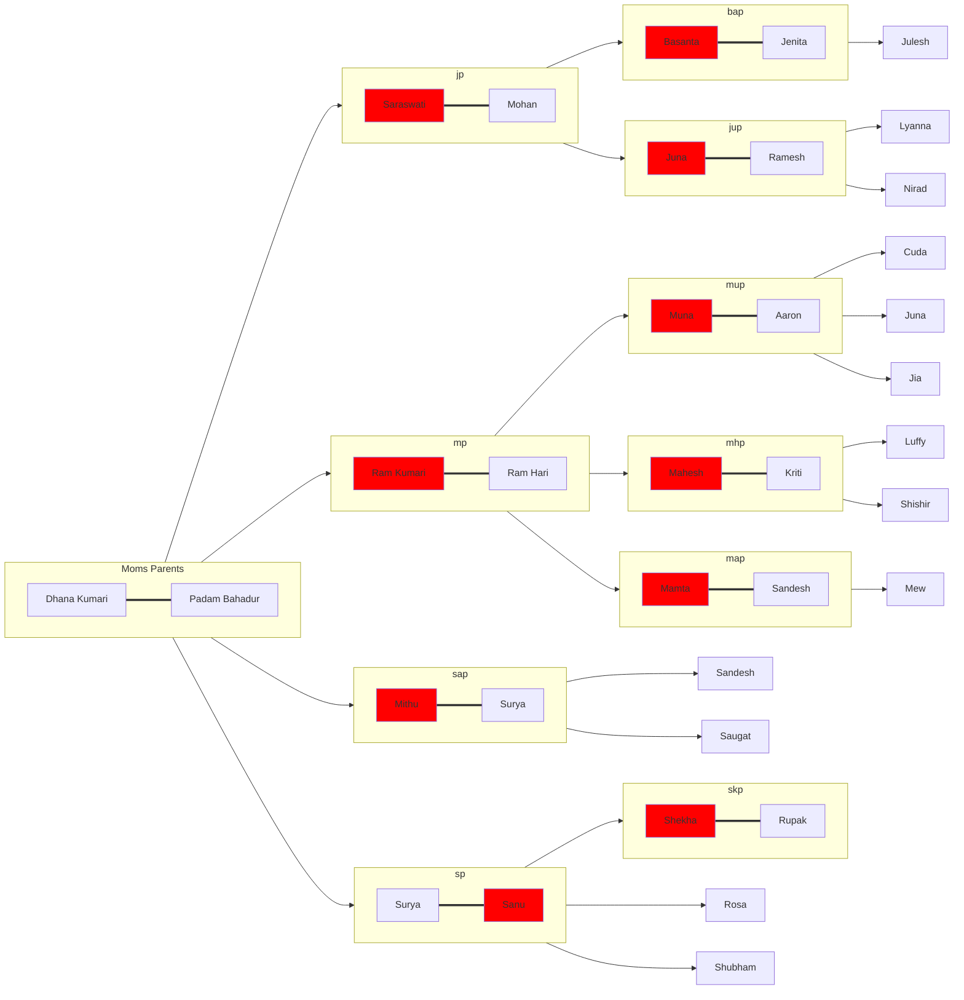
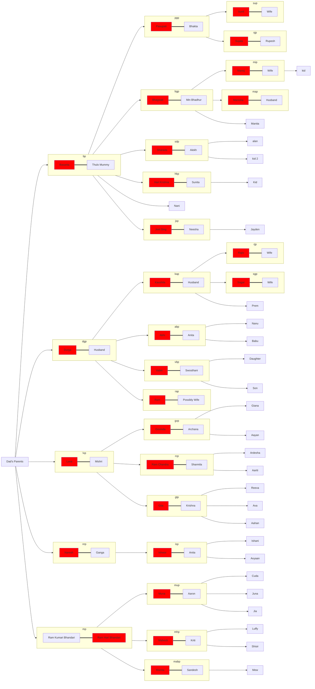
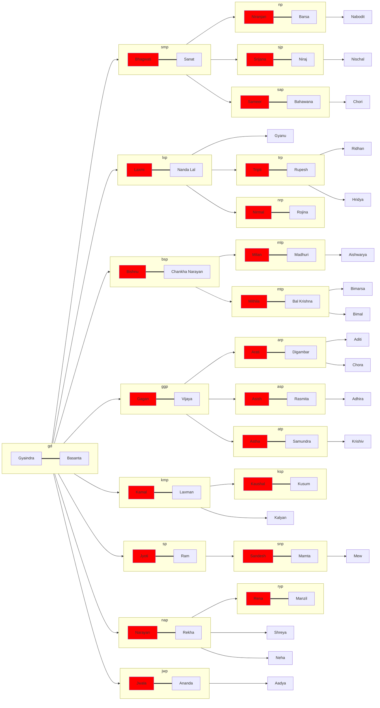
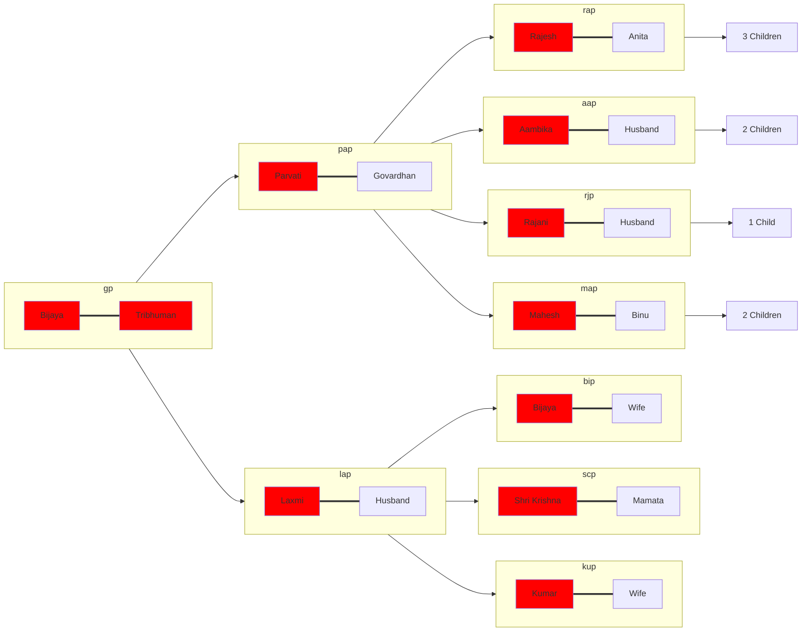

## Mamta

### Moms Side

```mermaid
flowchart LR;
gd --> jp & mp & sap & sp

jp --> bap & jup
bap --> Julesh
jup --> Lyanna & Nirad

mp --> mup & mhp & map
mup --> Cuda & Juna & Jia
mhp --> Luffy & Shishir
map --> Mew

sp --> skp & Rosa & Shubham 
sap --> Sandesh & Saugat


subgraph map
	direction LR
	Mamta:::blood === san[Sandesh]
end

subgraph bap
	direction LR
	Basanta:::blood === Jenita
end

subgraph jup
	direction LR
	jud[Juna]:::blood === Ramesh
end

subgraph skp
	direction LR
	Shekha:::blood === Rupak
end

subgraph mup
	direction LR
	Muna:::blood === Aaron
end

subgraph mhp
	direction LR
	Mahesh:::blood === Kriti
end

subgraph mp
	direction LR
	rkb[Ram Kumari]:::blood === rhb[Ram Hari]
end

subgraph sp
	direction LR
	msb[Surya] === msm[Sanu]:::blood
end

subgraph jp
	direction LR
	tm[Saraswati]:::blood === tb[Mohan]
end

subgraph gd[Moms Parents]
	direction LR
	dk[Dhana Kumari] === bu[Padam Bahadur]
end

subgraph sap
	direction LR
	sm[Mithu]:::blood === sb[Surya]
end


classDef blood fill:red
```

### Dad's side

```mermaid
flowchart LR;
gd[Dad's Parents] --> bp & dgp & lvp & nrp & mp

bp --> ppp & bgp & sdp & hkp & Sandhya[Nani] & jsp
ppp --> sup & sjp
hkp --> hkk[Kid]
bgp --> mip & map & Manita

sdp --> alan & sdk[kid 2]
mip --> kid
jsp --> Jayden

dgp --> kap & abp & vbp & rap
kap --> rjp & sgp & Prem
abp --> Nanu & Babu
vbp --> Daughter & Son

lvp --> gvp & rcp & gtp 
gvp --> Giana & Aayan
rcp --> Ardesha & Aariti
gtp --> Reeva & Ava & Aahan

nrp --> isp
isp --> Ishani & Avyaan

mp --> mup & mhp & mabp
mup --> Cuda & Juna & Jia
mhp --> Luffy & Shisir
mabp --> Mew


subgraph sgp
	direction LR
	Sagar:::blood === sgw[Wife]
end

subgraph rjp
	direction LR
	Rajiv:::blood === rjw[Wife]
end

subgraph kap
	direction LR
	kau[Kaushila]:::blood === kah[Husband]
end

subgraph mhp
	direction LR
	Mahesh:::blood === Kriti
end

subgraph mup
	direction LR
	Muna:::blood === Aaron
end

subgraph mabp
	direction LR
	Mamta:::blood === Sandesh
end

subgraph isp
	direction LR
	Ishwor:::blood === isa[Anita]
end

subgraph nrp
	direction LR
	Naresh:::blood === naw[Ganga]
end

subgraph gtp
	direction LR
	Gita:::blood === Krishna
end

subgraph rcp
	direction LR
	rc[Ram Chandra]:::blood === Sharmila
end

subgraph gvp
	direction LR
	Govinda:::blood === Archana
end

subgraph lvp
	direction LR
	Lava:::blood === Mishri
end

subgraph rap
	direction LR
	Ram:::blood === rmw[Possibly Wife]
end

subgraph vbp
	direction LR
	Vabin:::blood === Swosthani
end

subgraph abp
	direction LR
	Abhi:::blood === Anita
end

subgraph dgp
	direction LR
	Durga:::blood === dga[Husband]
end

subgraph jsp
	direction LR
	js[Jeet Sing]:::blood === Neesha
end

subgraph sdp
	direction LR
	Sharada:::blood === Alekh
end

subgraph hkp
	direction LR
	hk[Hari Krishna]:::blood === Sunita
end

subgraph map
	direction LR
	Manisha:::blood === mah[Husband]
end

subgraph mip
	direction LR
	Manoj:::blood === mjw[Wife]
end

subgraph bgp
	direction LR
	Bhagwati:::blood === mbd[Min Bhadhur]
end

subgraph sjp
	direction LR
	Sujata:::blood === sjh[Rupesh]
end

subgraph sup
	direction LR
	Sunil:::blood === snw[Wife]
end

subgraph ppp
	direction LR
	Pasupati:::blood === Bhakta
end

subgraph bp
	direction LR
	Basanta:::blood === tm[Thulo Mummy]
end

subgraph mp
	direction LR
	rkb[Ram Kumari Bhandari] === rhb[Ram Hari Bhandari]:::blood
end

classDef blood fill:red
```

## Sandesh

### Mom's side

```mermaid
flowchart LR;
gd --> smp & lxp & bsp & ggp & kmp & sp & nap & jwp

smp --> np & sjp & sap
sap --> Chori
np --> Nabodit
sjp --> Nischal

lxp --> Gyanu & trp & nrp
trp --> Ridhan & Hridya

bsp --> mlp
mlp --> Aishwarya
mtp --> Bimarsa & Bimal
bsp --> mtp

ggp --> arp & asp & atp
arp --> Aditi & Chora 
asp --> Adhira
atp --> Krishiv

kmp --> ksp & Kalyan

sp --> snp
snp --> Mew

nap --> ryp & Shreya & Neha

jwp --> Aadya

subgraph jwp
	direction LR
	Jwala:::blood === Ananda
end

subgraph ryp
	direction LR
	Rena:::blood === Manzil
end

subgraph nap
	direction LR
	Narayan:::blood === Rekha
end

subgraph snp
	direction LR
	Sandesh:::blood === Mamta
end

subgraph kmp
	direction LR
	Kamal:::blood === Laxman
end

subgraph ksp
	direction LR
	Kaushal:::blood === Kusum
end

subgraph ggp
	direction LR
	gg[Gagan]:::blood === vj[Vijaya]
end

subgraph arp
	direction LR
	ar[Arati]:::blood === dk[Digambar]
end

subgraph asp
	direction LR
	as[Asish]:::blood === rsm[Rasmita]
end

subgraph atp
	direction LR
	Astha:::blood === Samundra
end

subgraph bsp
	direction LR
	bsn[Bishnu]:::blood === cnk[Chankha Narayan]
end

subgraph mlp
	direction LR
	ml[Milan]:::blood === mad[Madhuri]
end


subgraph mtp
	direction LR
	mt[Mithila]:::blood === bal[Bal Krishna]
end

subgraph lxp
	direction LR
	lx[Laxmi]:::blood === nl[Nanda Lal]
end

subgraph trp
	direction LR
	tr[Tripti]:::blood === rp[Rupesh]
end


subgraph nrp
	direction LR
	nr[Nirmal]:::blood === ro[Rojina]
end

subgraph gd
	direction LR
	gs[Gyaindra] === gm[Basanta]
end

subgraph smp
	direction LR
	bs[Bhagwati]:::blood === ss[Sanat]
end

subgraph np
	direction LR
	ns[Niranjan]:::blood === bas[Barsa]
end

subgraph sap
	direction LR
	sam[Sameer]:::blood === bah[Bahawana]
end

subgraph sjp
	direction LR
	sj[Srijana]:::blood === nis[Niraj]
end

subgraph sp
	direction LR
	jks[Jyoti]:::blood === rcs[Ram]
end

classDef blood fill:red
```

## Dad's side

```mermaid
flowchart LR;
gp --> pap & lap

pap --> rap & aap & rjp & map
rap --> rac[3 Children]
aap --> aac[2 Children]
rjp --> rjc[1 Child]
map --> mac[2 Children]

lap --> bip & scp & kup

subgraph kup
	direction LR
	Kumar:::blood === kuw[Wife]
end

subgraph scp
	direction LR
	scc[Shri Krishna]:::blood === scw[Mamata]
end

subgraph bip
	direction LR
	bi[Bijaya]:::blood === biw[Wife]
end

subgraph lap
	direction LR
	Laxmi:::blood === lah[Husband]
end

subgraph map
	direction LR
	Mahesh:::blood === Binu
end

subgraph rjp
	direction LR
	Rajani:::blood === rjh[Husband]
end

subgraph aap
	direction LR
	Aambika:::blood === ab[Husband]
end

subgraph rap
	direction LR
	Rajesh:::blood === Anita
end

subgraph pap
	direction LR
	Parvati:::blood === Govardhan
end

subgraph gp
	direction LR
	Bijaya:::blood === Tribhuman:::blood
end

classDef blood fill:red
```
